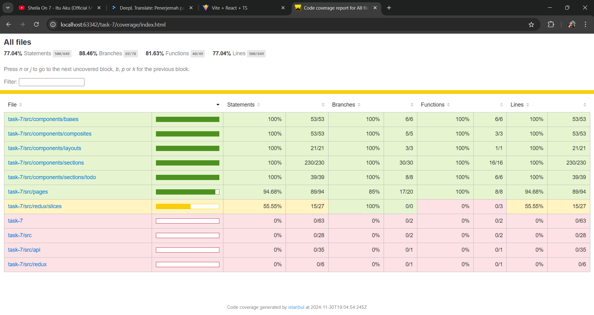

# [Task 7] ReactJS Testing, Component Testing

Implementasi pengujian komponen (Component Testing) dan Continuous Integration/Continuous Deployment (CI/CD) pipeline menggunakan GitHub Actions, 
pada website portfolio yang sudah dibuat pada Task 6 (https://github.com/mazzlookman/task-6-react-js-router).

# Unit test
All components testing are exist in `src/tests/` directory.

How to run?
```shell
npm install
```

```shell
npm test
```

With coverage:
```shell
npm test -- --coverage
```




# How to run this project?
You can check out the steps at the following repository bellow:
https://github.com/mazzlookman/task-6-react-js-router

Thanks. ✨

